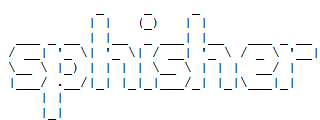

<!-- Zphisher -->

<p align="center">
  
</p>

<p align="center">
  
  
  
  
  
</p>

<p align="center">
  
  
  
</p>

<p align="center">A beginners friendly, Automated phishing tool with 30+ templates.</p>

##

### Features

- Latest and updated login pages.
- Mask URL support 
- Beginners friendly
- Docker support (checkout `docker-legacy` branch)
- Multiple tunneling options
  - Localhost
  - Ngrok (With or without hotspot)


### Installation

- Just, Clone this repository -
```
$ git clone git://github.com/sslri/sphisher.git
```

- Change to cloned directory and run `sphisher.sh` -
```
$ cd sphisher
$ bash sphisher.sh
```

- On first launch, It'll install the dependencies and that's it. `sphisher` is installed.

### Run on Docker
```
$ docker pull htrtech/sphisher
$ docker run --rm -it htrtech/sphisher
```

### Dependencies

**`sphisher`** requires following programs to run properly - 
- `php`
- `wget`
- `curl`
- `git`

> All the dependencies will be installed automatically when you run `sphisher` for the first time.

> Supported Platform : **`Termux`**, **`Ubuntu/Debian/Kali`**, **`Arch Linux/Manjaro`**, **`Fedora`**

## CONNECT WITH US :

<a href="https://github.com/sslri"></a>
[](https://instagram.com/sslri)
[](https://sslri.ir)
[](https://linkedin/sslri)
[](https://facebook.com/saeeddsalari)
[](https://t.me/sslri)
[](https://wa.me/989384491252)

## BUY ME A COFFEE ᵔ.ᵔ :

<p align="center">
<a href="https://l.jeeb.io/YjcwM"></a>
</p>